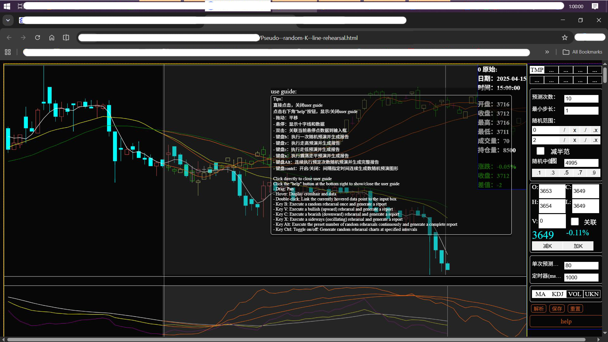
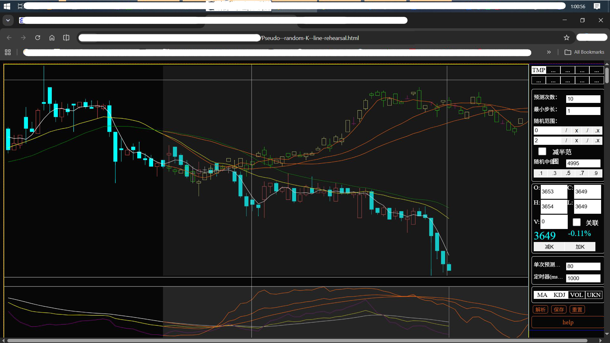
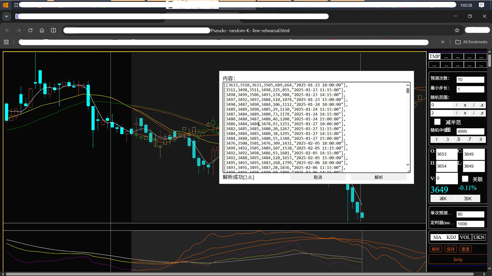
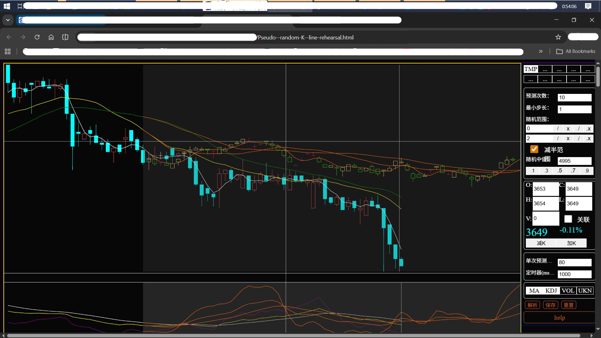
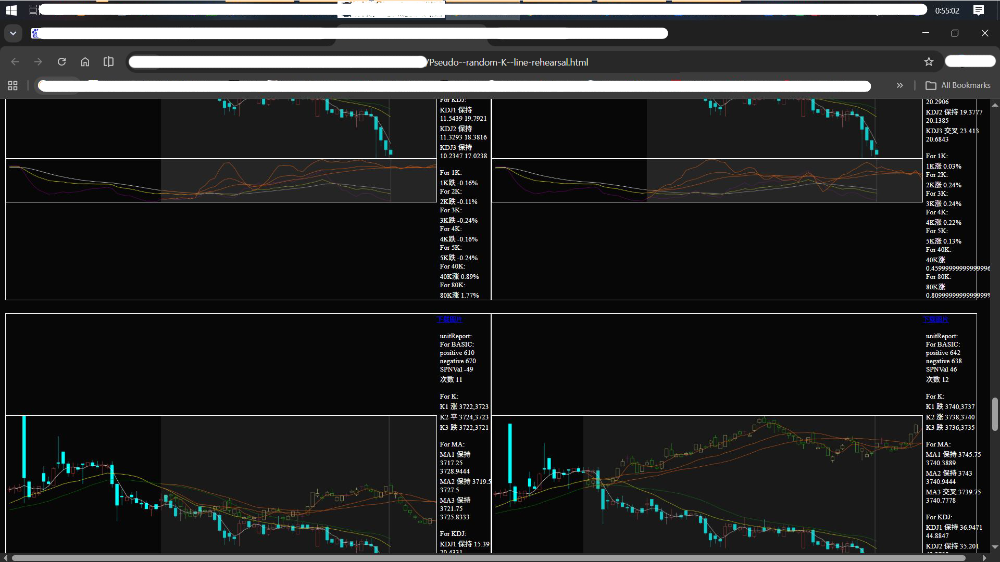
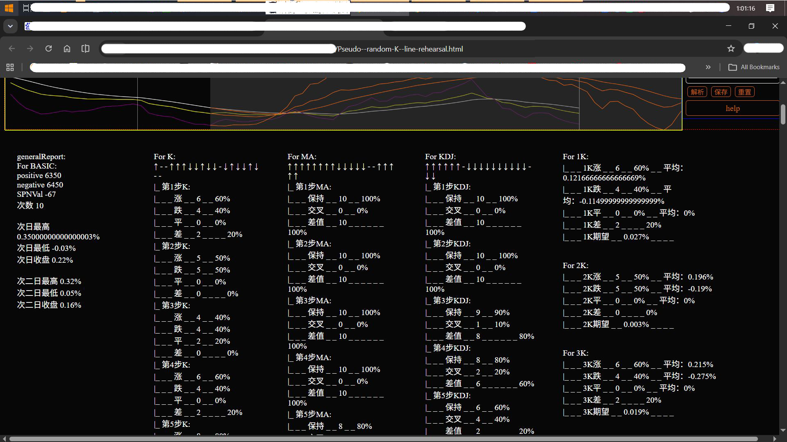

# Pseudo--random-K--line-rehearsal
# 伪随机预演K线

This is a browser-side K-line rehearsal tool. It organizes obtained data into the following format:

[[3633,3510,3633,3505,689,664,"2025-01-23 10:00:00"],
[3511,3498,3511,3498,225,855,"2025-01-23 11:15:00"],
[3498,3499,3506,3493,174,988,"2025-01-23 14:15:00"]]

Input for parsing to obtain the original chart.

The above data is a two-dimensional array with the following meaning:
Open, Close, High, Low, Volume, Open Interest, Time

Strict format requirements; incorrect format may cause parsing failure or errors.

You can operate on the parsed data using "加k" and "减k" on the right panel.

Add K uses O, C, H, L, V above the button as data, but data added this way will lack time and open interest.

After modification, you can save it as a txt file for future use.

"缩小振幅" can reduce the amplitude, suitable for cases where the original data has small amplitude.

Automatic chart recording.

The project can be used to study the relationship between market and randomness. Simple summary analysis is available, including MA moving average, KDJ, and VOL volume.

The project has disabled console.log output in JS. When needed, comment out the following code:

// Disable console.log output
if (typeof console === 'undefined') window.console = {};
if (!console.log) console.log = () => {};
console.log = () => {};

这是一个浏览器端的K线预演工具，将已经获得的数据整理成：
类似
[[3633,3510,3633,3505,689,664,"2025-01-23 10:00:00"],
[3511,3498,3511,3498,225,855,"2025-01-23 11:15:00"],
[3498,3499,3506,3493,174,988,"2025-01-23 14:15:00"]]
的形式，输入进行解析，获得原始图表。
以上数据是一个二维数组，含义：
开盘价，收盘价，最高价，最低价，成交量，持仓量，时间
格式要求严格，格式不对则可能解析失败或解析出错。
可以在右侧面板的"加k"和"减k"对解析进去的数据进行操作，
加k，用按钮上侧的O，C，H，L，V作为数据，但这种方式添加的数据会缺少时间和持仓量的数据。
修改完后可以进行保存，存为一个txt文件，以备下次再用。

"缩小振幅"，可以缩小振幅，适用于原始数据振幅小的情况，

自动记录图表。

项目可用于研究市场与随机的关系。可进行简单的总结分析，包括MA移动平均线，KDJ和VOL成交量

项目已经在js里关闭了console.log的输出。需要时需要对代码：
// 禁止console.log输出
if (typeof console === 'undefined') window.console = {};
if (!console.log) console.log = () => {};
console.log = () => {};
进行注释操作。

The readme document was manually written after a six-month interval and may not match the actual situation, It cannot be regarded as 100% correct.
readme文档为时隔半年后手动书写，可能与实际存在差别或者错别字，不能视为百分百正确。

---

## Quick Start
## 快速运行

Download all project files locally without changing the directory structure
将本项目所有文件，不动结构，下载至本地
双击pseudo--random-K--line-rehearsal.html转到浏览器直接运行。

---

## Features
## 功能特性

- **Display Historical Charts**: Display historical K-line data
- **展示历史图表**：展示历史的K线数据

- **Generate Pseudo-random Charts**: Draw new charts on historical data, displaying pseudo-randomly generated data
- **生成伪随机图表**：在历史数据上进行新的作图，展示伪随机生成的数据

- **Refresh Random Data at Intervals**
- **间隔时间刷新随机数据**

- **Generate Data Records and Analysis for Specified Times**
- **按指定次数生成数据记录和分析**

## Tech Stack
## 技术栈

| Category | Technology |
| 类别 | 技术 |
|----------|------------|
| Frontend | JavaScript, HTML5 Canvas |
| 前端 | JavaScript，HTML5 Canvas |

## Screenshots
## 截图

### Start
### 开始

### Decode
### 解析

### Amplitude Reduction
### 缩小振幅

### Image Record
### 数据图像记录

### Summary
### 总结数据

---

## License
## 许可证

This project is open-sourced under the [MIT License](LICENSE).
本项目采用 [MIT 许可证](LICENSE) 开源。

Copyright (c) 2026 gikmoogie

---

## Contact
## 联系方式

- GitHub: [@gikmoogie](https://github.com/gikmoogie)

---
&gt; Any questions, please feel free to contact. reply when i see it
&gt; 有任何问题可联系，看到会回复